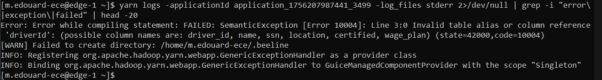
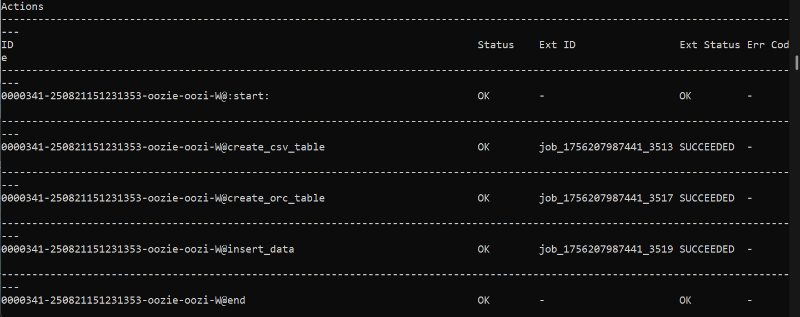

# Big Data — ECE Paris (2025/2026)

Travaux réalisés dans le module **Big Data Ecosystem** du cycle ingénieur de l'ECE Paris (majeure Data & IA), sur un **cluster Hadoop multi-nœuds sécurisé par Kerberos** (HDP 3.1).

**Stack :** Hadoop (HDFS, YARN, MapReduce / Hadoop Streaming) · Hive (Beeline, tables externes, ORC) · Oozie · Kerberos · Python · SQL (HiveQL) · Linux / SSH

---

## Pipeline couvert

```
Texte / CSV bruts sur HDFS
        │
        ├── MapReduce (Python, Hadoop Streaming) ── comptage de mots ── mot le plus fréquent
        │                                               │
        │                                               └── table Hive EXTERNAL ── requête SQL (Beeline)
        │
        └── Hive : table externe CSV ── transformation ── table ORC
                        └──────────── orchestré par un workflow Oozie ────────────┘
```

## 1. MapReduce avec Hadoop Streaming

📁 [`01-mapreduce-hadoop-streaming`](01-mapreduce-hadoop-streaming)

Deux jobs MapReduce écrits en Python, chaînés sur le texte de *Moby Dick* :

- **`word_count`** : le mapper émet `(mot, 1)` et le reducer additionne les occurrences.
- **`most_frequent`** : il part de la sortie du premier job. Le mapper émet tous les couples sous une **clé constante**, pour que Hadoop les envoie au même reducer. Le maximum est ainsi global, et non calculé par reducer.

**Résultat :** « the » est le mot le plus fréquent, avec **13 604 occurrences**.

Les jobs se lancent avec [`run_jobs.sh`](01-mapreduce-hadoop-streaming/run_jobs.sh). On peut les tester en local sans cluster :

```bash
cat texte.txt | python3 word_count/mapper.py | sort | python3 word_count/reducer.py \
              | python3 most_frequent/mapper.py | sort | python3 most_frequent/reducer.py
```

## 2. Data warehouse avec Hive

📁 [`02-hive-data-warehouse`](02-hive-data-warehouse)

- **[`nyc_drivers.hql`](02-hive-data-warehouse/nyc_drivers.hql)** : une table **externe** lit les CSV bruts sur HDFS sans les copier. On la transforme ensuite en table **ORC**, un format colonnaire compressé. Au passage, le nom est découpé en prénom et nom, `certified` passe de `Y/N` à un booléen, et les colonnes sont renommées. Les variables `hivevar` rendent le script réutilisable pour n'importe quel utilisateur.
- **[`wordcount.hql`](02-hive-data-warehouse/wordcount.hql)** : une table Hive est branchée directement sur la sortie du job MapReduce. La requête SQL `ORDER BY count DESC LIMIT 1` redonne le même résultat que le job `most_frequent` (« the », 13 604), ce qui confirme que les deux approches concordent.

## 3. Orchestration avec Oozie

📁 [`03-oozie-orchestration`](03-oozie-orchestration)

Le [`workflow.xml`](03-oozie-orchestration/hive-workflow/workflow.xml) enchaîne automatiquement les trois étapes Hive : création de la table CSV, puis de la table ORC, puis insertion. Chaque action Hive2 s'authentifie par Kerberos, et une erreur envoie le workflow vers un nœud `kill` qui affiche le message d'erreur. Le fichier [`job.properties`](03-oozie-orchestration/hive-workflow/job.properties) regroupe les paramètres du cluster et de l'utilisateur.

**Débogage en conditions réelles :** au premier lancement, l'action `insert_data` échoue (`KILLED`). Les logs YARN (`yarn logs -applicationId …`) montrent une `SemanticException`, car le script référençait `driverId` alors que la colonne s'appelle `driver_id`. Après correction et redéploiement sur HDFS, les trois actions réussissent.

<p align="center">
  
  
</p>

## Problèmes rencontrés et résolus

| Problème | Cause | Solution |
|---|---|---|
| Connexion Beeline refusée | Cluster sécurisé par Kerberos | Ticket `kinit`, puis principal Hive dans l'URL JDBC |
| `CREATE DATABASE` refusé | Pas de droit de création de base | Utilisation de la base partagée du groupe, avec un préfixe par utilisateur |
| Action Oozie `KILLED` | Nom de colonne erroné dans le script HQL | Diagnostic avec `yarn logs`, correction, redéploiement |
| Lignes en double dans la table ORC | `INSERT INTO` exécuté deux fois | `INSERT OVERWRITE`, qui rend le chargement rejouable |

## Auteur

**Édouard Menut**. Autres projets : [Machine Learning](https://github.com/Edouardmnt/ECE-Machine-Learning-2025-2026) · [Data Mining](https://github.com/Edouardmnt/ECE-Data-Mining-2025-2026).
